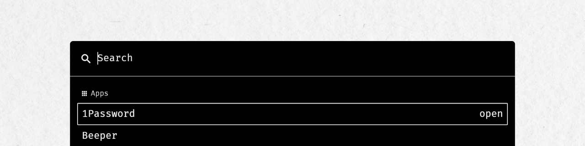

<p align="center">
    
</p>

# Centerpiece

_A blazing fast, extendable launcher for wayland._

centerpiece is designed with these values in mind:

- ⚡ blazing fast performance
- ⚫ minimalistic UI
- 🔌 extendable through plugins

## Demo


## Run it!

Centerpiece is not packed in any major package manager yet. However you can easily run it through nix.

**Try it using nix run**

```
nix run github:friedow/centerpiece
```

**Use it with home-manager**

1. Add this repository to your `flake.nix` inputs

   ```nix
   {
       inputs.centerpiece.url = "github:friedow/centerpiece";
   }
   ```

1. Register the home-manager module and enable centerpiece

   ```nix
   { inputs, ... }: {
       home-manager.users.<USER> = {
           imports = [ inputs.centerpiece.hmModules."x86_64-linux".default ];

           programs.centerpiece.enable = true;
       };
   }
   ```

1. See the ['Configure' section](#configure) for more nix config options.

## Plugins

All plugins are enabled by default. Disable the ones you don't need ;).

### Sway Window Switcher

_Search for open sway windows and switch between them._

**Related config keys**

```yml
# ~/.config/centerpiece/config.yml
plugin:
  sway_windows:
    enable: true
```

### Application Launcher

_Search for installed applications and launch them._

This plugin searches for `.desktop` files.
It follows the [XDG Base Directory Specification](https://specifications.freedesktop.org/basedir-spec/basedir-spec-latest.html).
Thus, it searches in directories specified in the `XDG_DATA_DIRS` and `XDG_DATA_HOME` environment variables.

**Related config keys**

```yml
# ~/.config/centerpiece/config.yml
plugin:
  applications:
    enable: true
```

### Browser Integration

_Open bookmarks and browser history in new tabs._

#### Brave

In addition to bookmarks and history there is also a plugin to open special bookmarks in app mode.
This will launch a brave instance without address and tab bar.
To use this plugin put bookmarks into a Bookmark folder called 'Progressive Web Apps' at the top of your bookmarks collection.

**Related config keys**

```yml
# ~/.config/centerpiece/config.yml
plugin:
  brave_bookmarks:
    enable: true
  brave_history:
    enable: true
  brave_progressive_web_apps:
    enable: true
```

#### Firefox

**Related config keys**

```yml
# ~/.config/centerpiece/config.yml
plugin:
  firefox_bookmarks:
    enable: true
  firefox_history:
    enable: true
```

### Git Repositories

_List git repositories in your home directory and open a terminal and an editor in them._

Selecting a git repository will execute the configured commands.
Defaults to opening a terminal and a code editor in the selected directory.

Searching for git repositories in the whole home directory is resource heavy.
To avoid delays in the plugin launch time this plugin comes with a systemd service which will create an index file.
This index file is located at `~/.cache/centerpiece/git-repositories-index.json` and necessary for the plugin to work.

It exports the following environment variables:

- `$GIT_DIRECTORY`: The path to the git directory.
- `$GIT_DIRECTORY_NAME`: The name of the git directory.

If `zoxide` integration is enabled, the plugin will sort your projects based on their respective `zoxide` scores.

**Related config keys**

```yml
# ~/.config/centerpiece/config.yml
plugin:
  git_repositories:
    enable: true
    zoxide: true
    commands:
      - ["alacritty", "--command", "nvim", "$GIT_DIRECTORY"]
      - ["alacritty", "--working-directory", "$GIT_DIRECTORY" "--class" "$GIT_DIRECTORY_NAME"]
```

### Gitmoji

_List gitmojis and copy them._

Note: You need to have [wl-clipboard](https://github.com/bugaevc/wl-clipboard) installed on your system.

**Related config keys**

```yml
# ~/.config/centerpiece/config.yml
plugin:
  gitmoji:
    enable: false
```

### System Commands

_Lock, sleep, restart or shutdown your system._

The following commands are executed when the respective actions are selected.

```
lock: lock
sleep: systemctl suspend
restart: reboot
shutdown: poweroff
```

**Related config keys**

```yml
# ~/.config/centerpiece/config.yml
plugin:
  system:
    enable: true
```

### WiFi

_List nearby wifi networks and connect to them._

**Related config keys**

```yml
# ~/.config/centerpiece/config.yml
plugin:
  wifi:
    enable: true
```

### Resource Monitor

_Display current cpu, ram, disk usage and battery state._

**Related config keys**

```yml
# ~/.config/centerpiece/config.yml
plugin
  resource_monitor_battery:
    enable: true
  resource_monitor_cpu:
    enable: true
  resource_monitor_disks:
    enable: true
  resource_monitor_memory:
    enable: true
```

### Clock

_Display current date and time._

**Related config keys**

```yml
# ~/.config/centerpiece/config.yml
plugin:
  clock:
    enable: true
```

## Configure

You can configure centerpiece through yaml or nix.

You can specify alternative configuration locations through:

- the `--config` flag
- the `CENTERPIECE_CONFIGURATION_FILE` environment variable

### Using yml

1. Create a `config.yml` file in `~/.config/centerpiece/config.yml`.
1. Use the following config keys to configure centerpiece. These are all config keys including their respective defaults.

   ```yml
   plugin:
     applications:
       enable: true
     brave_bookmarks:
       enable: true
     brave_history:
       enable: true
     brave_progressive_web_apps:
       enable: true
     clock:
       enable: true
     firefox_bookmarks:
       enable: true
     firefox_history:
       enable: true
     git_repositories:
       enable: true
       commands:
         - ["alacritty", "--command", "nvim", "$GIT_DIRECTORY"]
         - ["alacritty", "--working-directory", "$GIT_DIRECTORY"]
     gitmoji:
       enable: false
     resource_monitor_battery:
       enable: true
     resource_monitor_cpu:
       enable: true
     resource_monitor_disks:
       enable: true
     resource_monitor_memory:
       enable: true
     system:
       enable: true
     wifi:
       enable: true
     sway_windows:
       enable: true
   ```

### Using nix

1. Install the home-manager module as documented in the ['Run it!' section](#run-it).
1. Use the following config keys to configure centerpiece. These are all config keys including their respective defaults.

   ```nix
   { inputs, ... }: {
       home-manager.users.<USER> = {
           imports = [ inputs.centerpiece.hmModules."x86_64-linux".default ];

           programs.centerpiece = {
               enable = true;
               config = {
                   plugin = {
                       applications = {
                           enable = true;
                       };
                       brave_bookmarks = {
                           enable = true;
                       };
                       brave_history = {
                           enable = true;
                       };
                       brave_progressive_web_apps = {
                           enable = true;
                       };
                       clock = {
                           enable = true;
                       };
                       firefox_bookmarks = {
                           enable = true;
                       };
                       firefox_history = {
                           enable = true;
                       };
                       git_repositories = {
                           enable = true;
                           commands = [
                               ["alacritty" "--command" "nvim" "$GIT_DIRECTORY"]
                               ["alacritty" "--working-directory" "$GIT_DIRECTORY"]
                           ];
                       };
                       gitmoji = {
                           enable = false;
                       };
                       resource_monitor_battery = {
                           enable = true;
                       };
                       resource_monitor_cpu = {
                           enable = true;
                       };
                       resource_monitor_disks = {
                           enable = true;
                       };
                       resource_monitor_memory = {
                           enable = true;
                       };
                       system = {
                           enable = true;
                       };
                       wifi = {
                           enable = true;
                       };
                       sway_windows = {
                           enable = true;
                       };
                   };
               };

               # enables a systemd service to index git-repositories
               services.index-git-repositories = {
                    enable = true;
                    interval = "5min";
                };
           };
       };
   }
   ```

## Contribute

### Repository Structure

#### /client

Contains the graphical application and the plugin code that is needed during runtime. This is most of the plugin code which handles requests for searching and opening of entries.

#### /services

Computations for generating plugin entries can be time consuming. For example listing all git repositories entails searching your whole home directory for directories with the name `.git`. To avoid slowing down the graphical application during run time this directory contains code for small systemd services that write indices for plugins with time consuming queries.

## Development Setup

### Build Environment

The `flake.nix` provides a ready-to-roll build environment usable with `nix develop`.

### Building the Application

1. Run a new bash shell containing the build environment

   ```bash
   nix develop
   ```

2. Run the application

   ```bash
   cargo run
   ```
