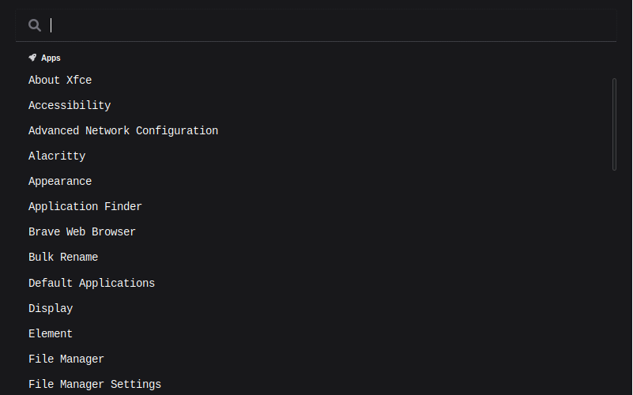

# search.friedow.com
search.friedow.com is a spotlight like search.
This project is currently in a very early state and tailored to my needs and daily workflows.




## Features
- Switch between open windows (i3)
- Open Applications (XDG based)


### Coming Soon™
- Move Windows between Workspaces (i3)
- Launch Applications on a new Workspace (i3)
- Open git repositories (vscode)
- Manage network connections
- See system statistics


## Installation
Currently, the easiest way to get a working executable for your platform is to [build it yourself](#building-the-application).
(Github Actions for cross-compiling are on my roadmap ;).


## Development Setup

### Build Environment
The `flake.nix` provides a ready-to-roll build environment usable with `nix develop`. If you are not using nix, please [install all prerequisites for tauri](https://tauri.app/v1/guides/getting-started/prerequisites).


### Building the Application
1. Run a new bash shell containing the build environment
    ```
    nix develop
    ```
1. Build the application
    ```
    npm run tauri build
    ```


### Recommended IDE Setup
- [VS Code](https://code.visualstudio.com/) + [Volar](https://marketplace.visualstudio.com/items?itemName=Vue.volar) + [rust-analyzer](https://marketplace.visualstudio.com/items?itemName=rust-lang.rust-analyzer)


### Type Support For `.vue` Imports in TS
Since TypeScript cannot handle type information for `.vue` imports, they are shimmed to be a generic Vue component type by default. In most cases this is fine if you don't really care about component prop types outside of templates. However, if you wish to get actual prop types in `.vue` imports (for example to get props validation when using manual `h(...)` calls), you can enable Volar's Take Over mode by following these steps:

1. Run `Extensions: Show Built-in Extensions` from VS Code's command palette, look for `TypeScript and JavaScript Language Features`, then right click and select `Disable (Workspace)`. By default, Take Over mode will enable itself if the default TypeScript extension is disabled.
2. Reload the VS Code window by running `Developer: Reload Window` from the command palette.

You can learn more about Take Over mode [here](https://github.com/johnsoncodehk/volar/discussions/471).
